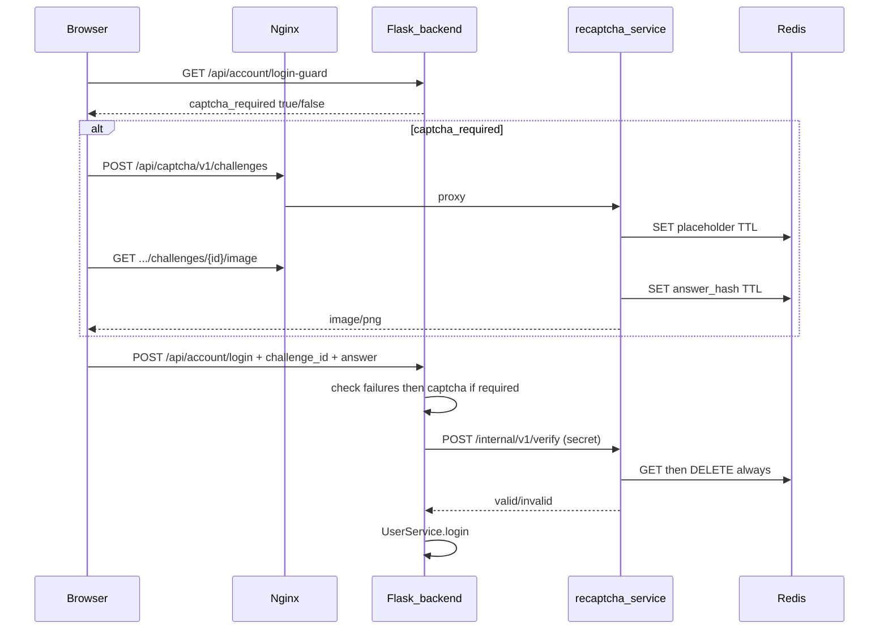

# Image CAPTCHA microservice and login integration

## Architecture



**Design choices (aligned with your selection and common patterns from [Redis CAPTCHA stores](https://oneuptime.com/blog/post/2026-03-31-redis-captcha-challenge-store/view) and [two-step challenge APIs](https://blog.siwei.dev/post/captcha-service-with-python-and-redis/)):**

| Concern | Approach |
|---------|----------|
| State | Redis with short TTL (challenge expires if unsolved) |
| Answer storage | SHA-256 hash only (never store plaintext in Redis) |
| One-time use | Delete Redis key on **every** verify attempt (wrong answer invalidates immediately) |
| Image generation | Custom Pillow renderer in the service (no heavy ML libs); 4 digits `0-9` |
| Anti-OCR | Per-digit rotation/scale, background noise dots/lines, sinusoidal warp, color jitter, optional light blur |
| Public vs private | Challenge + image endpoints public (rate-limited); verify endpoint **internal only** (shared secret) |
| Login policy | **After the first failed login** for that user **or** IP within the 15-minute window ([`login_recent_failures_time_span`](services/user.py)); still enforced **before** password check and before lockout (3 user / 5 IP) |
| Invalid captcha | Return `400` only; **do not** write a `LoginRecord` failure (avoids locking accounts via captcha mistakes) |

### Confirmed decisions

- CAPTCHA on login only when `CAPTCHA.enabled` and there is ≥1 recent failed login (user or IP).
- Threshold: **first failure** in the window triggers the challenge (not lockout-level only).
- Verify is server-side only; failed verify consumes the challenge (one-time).

---

## 1. New `recaptcha/` microservice

Create a self-contained Flask app (matches repo conventions: Flask 3+, pydantic v2, typed functions, gunicorn).

**Suggested layout:**

- [`recaptcha/app.py`](recaptcha/app.py) — routes, health
- [`recaptcha/generator.py`](recaptcha/generator.py) — Pillow image pipeline
- [`recaptcha/store.py`](recaptcha/store.py) — Redis access
- [`recaptcha/schemas.py`](recaptcha/schemas.py) — pydantic request/response models
- [`recaptcha/requirements.txt`](recaptcha/requirements.txt) — `flask`, `gunicorn`, `redis`, `Pillow`, `pydantic`
- [`recaptcha/Dockerfile`](recaptcha/Dockerfile) — slim Python 3.11 + DejaVu/font bundle for consistent glyphs

**Public API** (proxied at `/api/captcha/`):

| Method | Path | Behavior |
|--------|------|----------|
| `GET` | `/api/meta/health` | `{ "status": "ok" }` for compose healthcheck |
| `POST` | `/api/v1/challenges` | Create UUIDv4 `challenge_id`, store placeholder in Redis (`PENDING`), return JSON |
| `GET` | `/api/v1/challenges/<id>/image` | If placeholder valid: generate 4 digits, render PNG, store `answer_hash` + optional `client_ip`, set TTL (~120s default, env `CAPTCHA_TTL_SECONDS`) |

**Internal API** (not exposed via nginx):

| Method | Path | Behavior |
|--------|------|----------|
| `POST` | `/internal/v1/verify` | Header `X-Captcha-Secret`; body `{ challenge_id, answer, client_ip? }`; normalize answer (strip, digits only); compare hash; **always `DELETE` key**; return `{ valid: bool, reason?: ... }` |

**Redis keys:** `captcha:challenge:{uuid}` → hash fields `status`, `answer_hash`, `ip`, `created_at`.

**Abuse controls on the service:**

- Rate-limit `POST /challenges` per IP (e.g. 10/min via Redis counter)
- Reject invalid UUIDs
- Optional IP binding: if challenge was issued with IP, verify must match (auth backend forwards `_get_client_ip()`)

**Image generator (Pillow, not third-party CAPTCHA SaaS):**

- Size ~200×72 px, PNG
- Draw 4 digits individually with random rotation (-18°..18°), scale (0.85–1.15), x jitter
- Background: gradient + random dots + 2–4 interference lines
- Post-process: horizontal sine warp + light Gaussian noise
- Tunable via env: `CAPTCHA_NOISE_LEVEL` (0–2)

---

## 2. Docker Compose orchestration

Extend [`docker-compose.yml`](docker-compose.yml):

```yaml
redis:
  image: redis:7-alpine
  healthcheck: ...

recaptcha:
  build: ./recaptcha
  environment:
    REDIS_URL: redis://redis:6379/0
    CAPTCHA_SECRET: ${CAPTCHA_SECRET:-change_me}
    CAPTCHA_TTL_SECONDS: ${CAPTCHA_TTL_SECONDS:-120}
  depends_on:
    redis: { condition: service_healthy }

backend:
  environment:
    CAPTCHA_SERVICE_URL: http://recaptcha:8090
    CAPTCHA_SECRET: ${CAPTCHA_SECRET:-change_me}
  depends_on:
    recaptcha: { condition: service_healthy }
```

- Expose `recaptcha` only on the internal Docker network (no host port).
- Mirror service entries in [`docker-compose.offline.yml`](docker-compose.offline.yml) if prebuilt images are used.

---

## 3. Reverse proxy (frontend nginx + Vite dev)

**Production:** add to [`frontend/nginx/default.root.conf.template`](frontend/nginx/default.root.conf.template) and subpath variant:

```nginx
location /api/captcha/ {
    proxy_pass http://__CAPTCHA_UPSTREAM__;  # recaptcha:8090
    proxy_set_header X-Real-IP $remote_addr;
    ...
}
```

Pass `CAPTCHA_UPSTREAM` from compose (`recaptcha:8090`) like existing `BACKEND_UPSTREAM`.

**Dev:** extend [`frontend/vite.config.ts`](frontend/vite.config.ts) `flaskDevProxy` with `/api/captcha` → `http://127.0.0.1:8090` when running recaptcha locally.

---

## 4. Auth backend integration

### Config

Add to [`config.example.json`](config.example.json):

```json
"CAPTCHA": {
  "enabled": true,
  "service_url": "http://recaptcha:8090",
  "secret": "change_me",
  "ttl_seconds": 120
}
```

Wire env overrides in [`app.py`](app.py) `_load_config_with_env_overrides`: `CAPTCHA_ENABLED`, `CAPTCHA_SERVICE_URL`, `CAPTCHA_SECRET`.

Add `requests` usage pattern similar to [`IP_CHECK`](api_account.py) in new [`utils/captcha.py`](utils/captcha.py):

- `captcha_required_for_login(user, ip) -> bool` — query [`LoginRecordService`](services/login_record.py) for ≥1 **failed** record in the 15-minute window for resolved user **or** client IP (same data as lockout logic, threshold = 1 failure, independent of whether lockout would already block)
- `verify_captcha(challenge_id, answer, ip) -> bool` — POST to internal verify; map timeouts to safe failure

### New route: login guard (frontend UX)

In [`api_account.py`](api_account.py):

- `GET /api/account/login-guard?name_or_email=...` (optional username for user-scoped check)
- Returns `{ captcha_required: boolean }` using the same failure-window logic (IP always; user if name/email resolves)

### Login enforcement

Update `account_login()` in [`api_account.py`](api_account.py) **before** `UserService.login()`:

1. Resolve whether captcha is required (`CAPTCHA.enabled` and failure-window check).
2. If required: require `captcha_challenge_id` + `captcha_answer`; call `verify_captcha`; on failure return `400` with `msg: 'captcha invalid'` (do **not** proceed to password check / login record).
3. If not required: ignore captcha fields.

**Order matters:** captcha gate runs before password verification so bots cannot burn failure budget without solving.

### Dependency

Add no new backend deps beyond existing `requests` in [`requirements.txt`](requirements.txt).

---

## 5. Frontend integration

Shared login UI already centralizes at [`LoginForm.tsx`](frontend/src/components/auth/LoginForm.tsx) (used by [`LoginPage.tsx`](frontend/src/pages/LoginPage.tsx) and [`OAuthLoginPage.tsx`](frontend/src/pages/OAuthLoginPage.tsx)).

**New files:**

- [`frontend/src/api/captcha.ts`](frontend/src/api/captcha.ts) — `createChallenge()`, `captchaImageUrl(id)` (blob URL or direct `` with cache-bust)
- [`frontend/src/components/auth/CaptchaChallenge.tsx`](frontend/src/components/auth/CaptchaChallenge.tsx) — image, 4-digit `TextInput` / `PinInput`, refresh (new challenge)
- [`frontend/src/models/captcha.ts`](frontend/src/models/captcha.ts) — zod schemas for guard + challenge responses

**Flow in `LoginForm`:**

1. On mount (and when `name_or_email` changes, debounced): `fetchLoginGuard(name_or_email)` → set `captchaRequired`.
2. If required: auto-create challenge + show `CaptchaChallenge`.
3. Extend `LoginFormValues` with `captcha_challenge_id`, `captcha_answer`.
4. Validate: when `captchaRequired`, answer must be exactly 4 digits.
5. Update [`postLogin`](frontend/src/api/account.ts) body with captcha fields.

**i18n:** add strings in [`frontend/src/i18n/translations.ts`](frontend/src/i18n/translations.ts) (label, refresh, invalid captcha).

No build-time flag required; UI follows runtime `login-guard` API.

---

## 6. Tests

| Layer | What to test |
|-------|----------------|
| `recaptcha/` | Generator output length; verify success/fail deletes key; expired challenge; rate limit |
| `utils/captcha.py` | Mock HTTP verify; `captcha_required_for_login` with seeded `LoginRecord` rows |
| Optional API | Flask test client: login with failures → 400 without captcha; with mocked verify → proceeds |

Use pytest in repo root `tests/` for backend; add `recaptcha/tests/` for service unit tests.

---

## 7. Local development (conda `auth` env)

Document in plan execution (README snippet optional):

```bash
docker compose up redis recaptcha -d
# backend: CAPTCHA_SERVICE_URL=http://127.0.0.1:8090
# vite dev proxies /api/captcha
```

---

## Security notes

- Rotate `CAPTCHA_SECRET` in production; never expose internal verify to nginx.
- Captcha complements (does not replace) existing failure lockouts in [`services/user.py`](services/user.py).
- Lowercase/normalize answers only for digits; constant-time compare via `hmac.compare_digest` on hashes.
- Do not log correct answers or hashes with user identifiers.

## Out of scope (unless you ask later)

- CAPTCHA on register / password-reset endpoints
- 2FA step captcha
- Offline ML-based generators (e.g. deepcaptcha) — Pillow distortion is sufficient for v1
