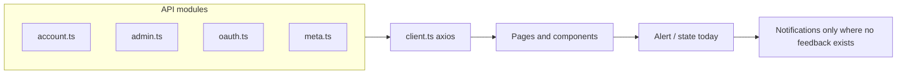

# Mantine Notifications for API feedback (minimal scope)

## Current state

- **Package**: [`frontend/package.json`](frontend/package.json) has `@mantine/core` v9 but **no** `@mantine/notifications`. Grep shows **no** usage of Mantine notifications anywhere.
- **App shell**: [`frontend/src/app/providers.tsx`](frontend/src/app/providers.tsx) wraps with `MantineProvider` only. [`frontend/src/main.tsx`](frontend/src/main.tsx) imports `@mantine/core/styles.css` only.
- **HTTP layer**: [`frontend/src/api/client.ts`](frontend/src/api/client.ts) uses a shared `axios` instance with response interceptors that attach [`BasicError`](frontend/src/models/apiError.ts) (`msg`, optional `detail`) to errors. [`getBasicErrorFromUnknown`](frontend/src/api/client.ts) is the standard way to read API errors in UI.
- **Feedback pattern today**: Almost all user-visible API outcomes use **inline** `<Alert>` or page-level state (`formError`, `pageError`, `profileOk`, etc.). Success for profile sections uses green `Alert` in [`frontend/src/pages/ProfilePage.tsx`](frontend/src/pages/ProfilePage.tsx); admin bulk email uses a green `Alert` in [`frontend/src/pages/admin/AdminSendEmailPage.tsx`](frontend/src/pages/admin/AdminSendEmailPage.tsx).

## API call inventory (frontend)

All network access goes through [`apiClient`](frontend/src/api/client.ts) in these modules:

| Module | Role |
|--------|------|
| [`frontend/src/api/account.ts`](frontend/src/api/account.ts) | Session (`whoami`, login, 2FA, logout), profile (`/me`, nickname, avatar, password), registration, email confirm/reconfirm, reset password, IP check, OAuth client list, external providers, 2FA setup/disable helpers, etc. |
| [`frontend/src/api/admin.ts`](frontend/src/api/admin.ts) | Admin users, groups, OAuth clients, invites, impersonation, send email, batch-related helpers |
| [`frontend/src/api/oauth.ts`](frontend/src/api/oauth.ts) | OAuth authorize flow: client metadata + connect URL |
| [`frontend/src/api/meta.ts`](frontend/src/api/meta.ts) | Version / about metadata |

**TanStack Query usage** (mutations + queries) appears in: [`LoginPage`](frontend/src/pages/LoginPage.tsx), [`OAuthLoginPage`](frontend/src/pages/OAuthLoginPage.tsx), [`RegisterPage`](frontend/src/pages/RegisterPage.tsx), [`ProfilePage`](frontend/src/pages/ProfilePage.tsx), [`TwoFactorSettingsPage`](frontend/src/pages/TwoFactorSettingsPage.tsx), [`ConfirmEmailPage`](frontend/src/pages/ConfirmEmailPage.tsx), [`ResetPasswordPage`](frontend/src/pages/ResetPasswordPage.tsx), [`RequestResetPasswordPage`](frontend/src/pages/RequestResetPasswordPage.tsx), [`RequestReconfirmEmailPage`](frontend/src/pages/RequestReconfirmEmailPage.tsx), [`RequestDisableTwoFactorPage`](frontend/src/pages/RequestDisableTwoFactorPage.tsx), [`DisableTwoFactorByEmailPage`](frontend/src/pages/DisableTwoFactorByEmailPage.tsx), [`HomePage`](frontend/src/pages/HomePage.tsx), [`RequireAuth`](frontend/src/components/auth/RequireAuth.tsx), all [`admin/*`](frontend/src/pages/admin/) list/edit pages and modals, [`AdminBatchUsersPage`](frontend/src/pages/admin/AdminBatchUsersPage.tsx), [`AdminSendEmailPage`](frontend/src/pages/admin/AdminSendEmailPage.tsx), [`AdminAboutPage`](frontend/src/pages/admin/AdminAboutPage.tsx).

**Non–React Query call**: [`LogoutPage`](frontend/src/pages/LogoutPage.tsx) calls `getLogout()` inside `useEffect` and shows inline success/error.

**Presentation-only API error usage**: [`AppGrid`](frontend/src/components/apps/AppGrid.tsx) receives `error` from parent queries and renders an `Alert` (Home flow).

## Design principles (minimal notifications)

1. **Do not add notifications for API success/error** where the UI already shows an `Alert`, page state, or dedicated success screen—**no duplicate channels**.
2. **No global axios interceptor** for toasts.
3. **Necessary use case** in this codebase: **clipboard operations** give the user no confirmation after `navigator.clipboard.writeText` in [`AdminOAuthClientEditPage`](frontend/src/pages/admin/AdminOAuthClientEditPage.tsx) (`copySecret`) and [`AdminUserEditPage`](frontend/src/pages/admin/AdminUserEditPage.tsx) (`copyUrlM` after `getAdminConfirmEmailUrl` succeeds). A short success notification (and error notification if `writeText` throws) is justified and does not overlap existing `Alert`s.
4. **Skip** unless a future need appears: profile green `Alert`s, admin save toasts, 2FA success toasts, batch/email alignment, `LogoutPage` toasts, and generic `showBasicError` helpers.

## Implementation plan

### 1. Add dependency and styles

- Add `@mantine/notifications` aligned with `@mantine/core` (^9).
- Import `@mantine/notifications/styles.css` in [`frontend/src/main.tsx`](frontend/src/main.tsx) next to core styles.

### 2. Mount the notifications layer

- In [`frontend/src/app/providers.tsx`](frontend/src/app/providers.tsx), render `<Notifications />` from `@mantine/notifications` **inside** `MantineProvider`.
- Set defaults once (`position`, `autoClose`) as needed.

### 3. Call sites (only these)

| Location | Change |
|----------|--------|
| [`AdminOAuthClientEditPage`](frontend/src/pages/admin/AdminOAuthClientEditPage.tsx) `copySecret` | After successful `writeText`, `notifications.show` success; `try/catch` with error notification on failure. |
| [`AdminUserEditPage`](frontend/src/pages/admin/AdminUserEditPage.tsx) `copyUrlM` `onSuccess` | After `clipboard.writeText`, same pattern (success + catch). The API error path is already `getAdminConfirmEmailUrl` failure via `pageError`—keep that; only clipboard failure gets an error toast. |

**No** shared `utils/notifications.ts` unless you prefer a one-line wrapper for the two clipboard call sites; inline `notifications.show` with i18n strings is acceptable to keep the change tiny.

### 4. i18n

- Add minimal keys in [`frontend/src/i18n/translations.ts`](frontend/src/i18n/translations.ts) (English and Chinese), e.g. **copied to clipboard** and **copy failed** (or reuse existing patterns if similar keys exist).

## Explicitly out of scope

- Profile, TwoFactor, admin list/edit mutations, modals, `AdminSendEmailPage`, `AdminBatchUsersPage`, `LogoutPage`, public auth pages, `RequireAuth`, `AppGrid` — **no** new notifications; existing UX stays as-is.

## Files likely touched

- [`frontend/package.json`](frontend/package.json)
- [`frontend/src/main.tsx`](frontend/src/main.tsx)
- [`frontend/src/app/providers.tsx`](frontend/src/app/providers.tsx)
- [`frontend/src/pages/admin/AdminOAuthClientEditPage.tsx`](frontend/src/pages/admin/AdminOAuthClientEditPage.tsx)
- [`frontend/src/pages/admin/AdminUserEditPage.tsx`](frontend/src/pages/admin/AdminUserEditPage.tsx)
- [`frontend/src/i18n/translations.ts`](frontend/src/i18n/translations.ts)

## QA

- Manual: copy OAuth client secret and admin confirm-email URL; confirm success toast and simulate clipboard denial (if feasible) for error path.
