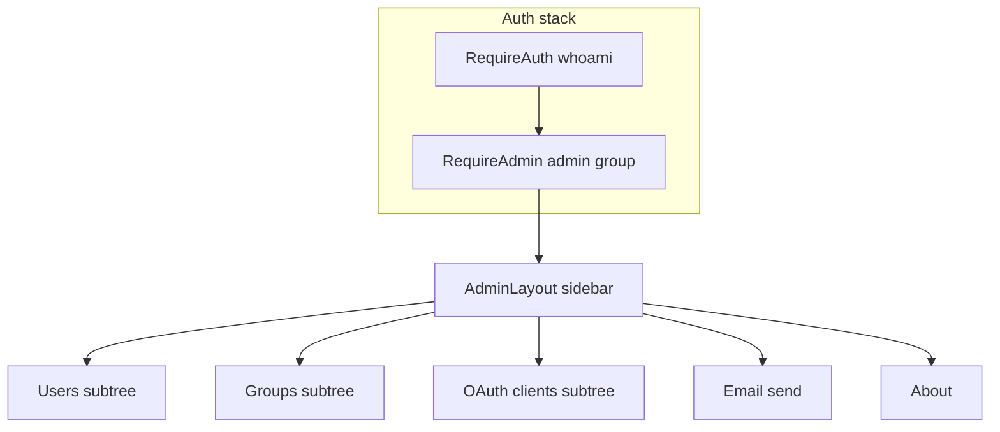

# React admin console implementation plan

## Source of truth

- **Backend**: [`api_admin.py`](/home/kelvin/IdeaProjects/auth/api_admin.py) — all admin endpoints live under `/api/admin/*` and are protected by `@requires_admin` ([`utils/session.py`](/home/kelvin/IdeaProjects/auth/utils/session.py): non-admins get **403** with `msg: 'admin required'`; unauthenticated **401**).
- **Reference UI / flows**: Angular routes in [`angular/src/app/app.routes.ts`](/home/kelvin/IdeaProjects/auth/angular/src/app/app.routes.ts) (lines 83–133), nav in [`angular/src/app/admin/admin.component.html`](/home/kelvin/IdeaProjects/auth/angular/src/app/admin/admin.component.html), HTTP mapping in [`angular/src/app/admin.service.ts`](/home/kelvin/IdeaProjects/auth/angular/src/app/admin.service.ts).
- **React today**: Authenticated shell in [`frontend/src/app/routes.tsx`](/home/kelvin/IdeaProjects/auth/frontend/src/app/routes.tsx) + [`RequireAuth`](/home/kelvin/IdeaProjects/auth/frontend/src/components/auth/RequireAuth.tsx); **no** `/admin` routes yet; [`HomePage.tsx`](/home/kelvin/IdeaProjects/auth/frontend/src/pages/HomePage.tsx) still has a local `isAdmin()` used for badge/2FA banner (Management button was removed earlier).

## Target URL map (parity with Angular)

Keep the same paths so bookmarks and the generated OAuth config file (`admin_user_page`, `admin_group_page` in [`api_admin.py`](/home/kelvin/IdeaProjects/auth/api_admin.py) ~485–486) stay valid:

| Path | Purpose |
|------|---------|
| `/admin` | Redirect → `/admin/account/users` |
| `/admin/account/users` | User list |
| `/admin/account/users/u/:uid` | User detail / edit |
| `/admin/account/users/invite` | Invite user |
| `/admin/account/users/batch` | Batch operations |
| `/admin/account/groups` | Group list |
| `/admin/account/groups/g/:gid` | Group edit |
| `/admin/account/groups/new` | New group |
| `/admin/oauth/clients` | OAuth client list |
| `/admin/oauth/clients/c/:cid` | OAuth client edit |
| `/admin/oauth/clients/new` | New OAuth client |
| `/admin/email/send` | Broadcast email |
| `/admin/about` | Version / about |

## 1. Access control

- Add **`RequireAdmin`** (new component, e.g. [`frontend/src/components/auth/RequireAdmin.tsx`](frontend/src/components/auth/RequireAdmin.tsx)):
  - Use **`useAuthUser()`** (same user object as rest of app; already includes `groups` from whoami).
  - If not in `admin` group: **`<Navigate to="/forbidden" replace />`** (same as [`angular/src/app/auth-admin.guard.ts`](/home/kelvin/IdeaProjects/auth/angular/src/app/auth-admin.guard.ts)).
  - Do **not** duplicate another whoami fetch; rely on parent `RequireAuth` + `AuthUserProvider`.
- Extract **`isAdmin(user)`** from `HomePage` into a tiny shared helper (e.g. [`frontend/src/utils/isAdmin.ts`](frontend/src/utils/isAdmin.ts)) and use it in **`RequireAdmin`**, **`HomePage`**, and the restored Management link.

**Optional hardening (later):** axios interceptor on **403** from `/api/admin/*` → navigate to `/forbidden` (covers session/group changes without full reload).

## 2. Layout and routing

- Add **`AdminLayout`** (e.g. [`frontend/src/components/layout/AdminLayout.tsx`](frontend/src/components/layout/AdminLayout.tsx)): Mantine **AppShell** or **Grid** with a **vertical Nav** mirroring Angular’s menu (Home, Account → Users / Groups, OAuth → Clients, Email → Send, About) + shortcuts to **`/account/profile`** and **`/account/logout`**.
- In [`frontend/src/app/routes.tsx`](frontend/src/app/routes.tsx), under the existing authenticated branch, add a sibling layout route:

  - `element`: `<RequireAuth><AdminLayout /></RequireAuth>` (or nest `RequireAdmin` inside layout once).
  - Children: index `Navigate` to `account/users`, then nested routes as in the table above.

- Re-add on **HomePage** a **Management** `Button`/`Link` to **`/admin`** visible only when `isAdmin(user)`.

## 3. API client and types

- New module **[`frontend/src/api/admin.ts`](frontend/src/api/admin.ts)** (axios via existing [`frontend/src/api/client.ts`](frontend/src/api/client.ts)): one function per Angular `AdminService` method, same paths and verbs.
- **Special HTTP shapes** (must match Flask):
  - **GET `/api/admin/users`** (no query): response is **`{ users, groups }`** with `group_ids` on users — **merge** into `groups[]` like Angular ([`admin.service.ts` 50–69](/home/kelvin/IdeaProjects/auth/angular/src/app/admin.service.ts)).
  - **PUT user / client** with file: **`multipart/form-data`** (`avatar` / `icon`); JSON updates use `application/json`.
  - **GET `/api/admin/clients/:cid/generate-config-file`**: response is **download** (`Content-Disposition`) — use `responseType: 'blob'` and trigger browser download (filename `oauth.config.json`).
  - **204** bodies: many mutations return empty — handle as success without JSON.
- New **Zod** schemas in e.g. [`frontend/src/models/admin.ts`](frontend/src/models/admin.ts) (or split by domain) for:
  - **Admin user**: extend current [`UserSchema`](frontend/src/models/user.ts) with `group_ids`, `created_at`, `modified_at`, `email_confirmed_at`, `is_email_confirmed` (datetimes as **ISO strings** from JSON), optional `authorizations` when `oauth-info=true`.
  - **Group** (admin): `created_at`, `modified_at`, optional `allowed_clients` / `user_ids` when flags used.
  - **OAuth client** (admin): includes **`secret`**, **`redirect_url`**, **`allowed_groups`**, timestamps.
  - **Login record**, **OAuth authorization**, **IP info**, **send-email** response (`num_recipients`), **confirm-email URL** (`{ url }`).
- Use **TanStack Query** for lists/detail (cache keys per resource id), **mutations** for writes; after **impersonate**, **invalidate `whoami`** and **`Navigate` to `/`**.

## 4. Pages (implementation order)

Suggested phasing balances **user value** vs **complexity**:

### Phase A — Shell + users (highest priority)

- **Admin users list**: table (Mantine `DataTable` if already in project, else `Table` + sort/filter client-side); show name, email, active, email confirmed, groups; link to edit; actions: Invite, Batch (links).
- **Invite user**: form fields matching POST body: `name`, `email`, `external_auth_provider_id` (reuse patterns from account APIs if providers are already fetched elsewhere), `skip_email_confirmation`.
- **User edit** (`u/:uid`): load with **`oauth-info=true`**; sections aligned with Angular:
  - Status: active / inactive (**PUT/DELETE** `/active`).
  - Profile: nickname (**JSON PUT**).
  - Avatar: file upload (**multipart PUT**), same constraints as profile (square, type/size — reuse validation helper from [`ProfilePage`](frontend/src/pages/ProfilePage.tsx) where possible).
  - Email: **reconfirm** (POST), **copy confirm URL** (GET confirm-email-url).
  - **Login records**: GET with `country=true`; display IP, time, success, optional country; **user-agent** can be parsed with **`ua-parser-js`** (Angular uses it) or shown raw initially.
  - **External info**: GET `ext-info` (shape from Angular `ExternalUserInfoResult`).
  - **Impersonate**: confirm modal → GET impersonate → invalidate session queries → home.
  - **Delete user**: confirm modal → DELETE.
  - **OAuth authorizations**: from same user payload when `oauth-info=true`.

### Phase B — Groups

- **List**; **new** (POST name + description); **edit** (`g/:gid`): update description (PUT); member list with add/remove (**PUT/DELETE** `/groups/:gid/users/:uid` or `user-by-name/:name`); optional **`oauth-info=true`** on GET to manage related UI if needed.

### Phase C — OAuth clients

- **List** (secrets visible — treat like Angular: careful UX, mask/copy).
- **New** / **edit**: redirect URL, home URL, description; **icon** upload; **public** toggle; **regenerate secret**; **download config** file; **authorizations** list; **allowed groups** add/remove (search groups by name like Angular edit client).

### Phase D — Batch users, email, about

- **Batch** ([`admin-account-users-batch.component.ts`](/home/kelvin/IdeaProjects/auth/angular/src/app/admin-account-users-batch/admin-account-users-batch.component.ts)): port CSV/TSV/JSON parsing, debounced preview, and bulk flows (invite / find / delete / add-remove group). This is the **largest** single page; isolate in one file + small parsers util if needed.
- **Send email**: POST `/api/admin/send-email` with subject, receivers, receiver_groups, body; show recipient count from response.
- **About**: GET **`/api/meta/version`** ([`api_meta.py`](/home/kelvin/IdeaProjects/auth/api_meta.py)) — note **`@requires_login`**, not admin-only; fine for logged-in admin. Display commit string; optional link to env/build info if desired.

## 5. Internationalization

- Add **en** / **zh-Hans** keys in [`frontend/src/i18n/translations.ts`](frontend/src/i18n/translations.ts) for all admin UI strings (nav labels, table headers, buttons, confirmations, errors). Reuse existing generic keys (`retry`, `fieldRequired`, etc.) where they already fit.

## 6. Testing and quality gates

- **Vitest**: Zod parse tests for representative **admin JSON** payloads (user list envelope, user with `authorizations`, OAuth client with `secret` and `allowed_groups`) — similar spirit to [`frontend/src/models/user.test.ts`](frontend/src/models/user.test.ts).
- Run **`npm run lint`** and **`npx tsc -b`** after each phase.

## 7. Dependencies

- Likely add **`ua-parser-js`** (+ types if needed) for login record UX parity; optional if you defer parsing and show raw `user_agent` first.

## Explicit non-goals

- **No Flask changes** unless you discover a true contract bug (the React port should consume existing APIs).
- **No redesign** of information architecture beyond adapting Angular’s structure to Mantine components.
