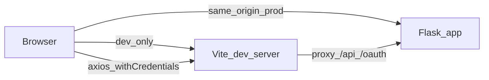

# Minimal React frontend (per frontend-rules)

## Context

- Backend is Flask in [app.py](app.py): static SPA from `static/browser`, JSON under `/api/account`, `/api/admin`, `/api/oauth`, `/api/meta`. SPA fallback routes already cover `/`, `/account/*`, `/settings/*`, `/admin/*`, `/oauth/*`.
- The current UI is Angular under [angular/](angular/) and builds to `../static` with `deployUrl: static/` (output ends up as `static/browser/`), matching `_STATIC_ROOT_PATH = 'static/browser'`.
- Account API uses **session cookies**; Angular calls **relative** URLs like `api/account/...`. React must use axios with `withCredentials: true` and the same paths.
- `GET /api/account/whoami` returns **204 No Content** with an empty body when there is no logged-in user ([api_account.py](api_account.py) `account_who_am_i`). The client must treat 204 as “no user”, not as a JSON parse error.

## 1. Core scaffold (detailed)

### 1.1 `features/` vs `components/` + `hooks/`

Neither is universally “better”; they optimize for different scaling stories.

- `**features/` (vertical slices):** Each folder owns UI + hooks + local state for a domain (e.g. `features/auth/`). Best when many domains grow large and you want colocation without hunting across `components/` and `hooks/`.
- `**components/` + `hooks/` (horizontal layers):** Familiar, shallow tree; easy for small apps and for shared primitives. Risk: `components/` becomes a flat junk drawer unless you use **subfolders by domain** (e.g. `components/auth/`).

For this **minimal** scaffold, `**components/` + `hooks/`** is a good fit: fewer folders to navigate, and domain is still clear via `components/auth/*` and `hooks/useSafeRedirectPath.ts` (or `hooks/auth/*` if you prefer). If the app later grows many auth-adjacent files, you can **rename** `components/auth` + auth hooks into `features/auth` without changing public routes.

**Convention for this project:** Route-level screens live in `**pages/`**; reusable auth UI and guards live in `**components/auth/`**; reusable stateless logic in `**hooks/**` (optionally `hooks/auth/` if hook count grows).

### 1.2 Directory layout

Proposed tree under `frontend/`:

```text
frontend/
├── .env.example                 # VITE_FLASK_ORIGIN=http://127.0.0.1:8077
├── eslint.config.js             # typescript-eslint + react-hooks; import eslint-plugin-react (flat config)
├── index.html
├── package.json
├── public/
│   └── favicon.ico              # copy or symlink from angular if desired
├── tsconfig.json
├── tsconfig.app.json
├── tsconfig.node.json
├── vite.config.ts
└── src/
    ├── main.tsx                 # bootstrap only: providers + router
    ├── vite-env.d.ts
    ├── app/
    │   ├── App.tsx              # thin shell: <Outlet /> or route element wrapper if preferred
    │   ├── providers.tsx        # MantineProvider, QueryClientProvider, Provider (Redux), optional ColorSchemeScript
    │   ├── routes.tsx           # createBrowserRouter route objects OR Routes/Route JSX
    │   └── store.ts             # configureStore + typed hooks (useAppDispatch, useAppSelector)
    ├── api/
    │   ├── client.ts            # axios instance + response interceptor for ApiError
    │   └── account.ts           # fetchWhoami, postLogin, getLogout, postTwoFactorLogin, fetchMyOAuthClients
    ├── components/
    │   ├── auth/
    │   │   ├── RequireAuth.tsx  # waits for whoami; redirects to /account/login?redirect=...
    │   │   ├── LoginForm.tsx    # password fields + submit (phase A of login)
    │   │   └── TwoFactorPanel.tsx
    │   └── apps/
    │       └── AppGrid.tsx      # minimalist “My apps” grid (OAuth clients); see §3.1
    ├── hooks/
    │   ├── useSafeRedirectPath.ts   # same-origin ?redirect= parsing; default /
    │   └── useRedirectAfterLogin.ts # optional: navigate when whoami already set (compose safe path)
    ├── pages/
    │   ├── HomePage.tsx
    │   ├── LoginPage.tsx        # composes LoginForm + TwoFactorPanel; owns step state password | 2fa
    │   ├── LogoutPage.tsx
    │   └── NotFoundPage.tsx
    ├── models/
    │   ├── apiError.ts          # zod schema BasicError + helper parseApiError(axios error)
    │   ├── user.ts              # zod UserSchema, GroupSchema (nested), inferred types
    │   ├── oauthClient.ts       # zod OAuthClientSchema for GET /api/account/clients items
    │   └── siteConfig.ts        # optional zod for subset of config.json exposed via import or VITE_*
    ├── theme.ts                 # Mantine theme override (fonts, primary color)
    └── test/
        └── setup.ts             # vitest jsdom setup if needed
```

Rationale: `app/` holds cross-cutting wiring; `api/` is transport; `models/` is zod + types only; `components/auth/` holds reusable auth UI; `components/apps/` holds the home **App List** grid; `hooks/` holds redirect helpers and other shared hooks; `pages/` holds route-mapped screens that compose components and wire mutations/queries.

### 1.3 Dependencies (package.json) — role of each


| Package                                                      | Role                                                                                                                                                                                   |
| ------------------------------------------------------------ | -------------------------------------------------------------------------------------------------------------------------------------------------------------------------------------- |
| `react` / `react-dom`                                        | UI; require **19+** per rules.                                                                                                                                                         |
| `react-router`                                               | Declarative routing; use `**createBrowserRouter`** + `RouterProvider` (data APIs optional; can use plain loaders later).                                                               |
| `@mantine/core` / `@mantine/hooks` / `@mantine/form`         | Layout, inputs, `useForm` for login (optional vs controlled state).                                                                                                                    |
| `@emotion/react`                                             | Peer for Mantine styles in v7+.                                                                                                                                                        |
| `@tabler/icons-react`                                        | Icons (e.g. `IconLogout`, `IconUser`) on home / nav.                                                                                                                                   |
| `zod`                                                        | **v4+** schemas for `User`, `Group`, `BasicError`; runtime validation of JSON.                                                                                                         |
| `@reduxjs/toolkit` / `react-redux`                           | **Minimal slice** (e.g. `uiSlice` with `sidebarOpened` or empty placeholder slice) so the stack matches rules; auth session stays in **React Query**, not Redux, to avoid duplication. |
| `@tanstack/react-query`                                      | `whoami` query, `login` / `logout` / `twoFactorLogin` mutations, `queryClient.invalidateQueries` after success.                                                                        |
| `axios`                                                      | **v1.12+**; `withCredentials: true`; central error handling.                                                                                                                           |
| `vite`                                                       | **v7+** build and dev server.                                                                                                                                                          |
| `@vitejs/plugin-react`                                       | Fast refresh.                                                                                                                                                                          |
| `typescript`                                                 | **v5+**; `strict` true.                                                                                                                                                                |
| `vitest` / `jsdom` / `@testing-library/react`                | At least one test (schema or small component).                                                                                                                                         |
| `eslint` / `typescript-eslint` / `eslint-plugin-react-hooks` | Lint per rules.                                                                                                                                                                        |


Dev-only: `@types/react`, `@types/react-dom` as needed.

### 1.4 Vite configuration ([frontend/vite.config.ts](frontend/vite.config.ts))

- `**base: '/static/'`** — matches Angular `deployUrl` so asset URLs in `index.html` resolve under Flask’s `static_url_path` (`/static`).
- `**build.outDir: '../static/browser'`** and `**emptyOutDir: true`** — replaces Angular output location expected by [app.py](app.py).
- `**server.proxy`**: proxy `/api` and `/oauth` to `process.env.VITE_FLASK_ORIGIN` (from `.env.development`) so the browser origin stays `localhost:5173` while cookies are set by Flask on the **target** host. **Caveat:** for cookie `Set-Cookie` to work through a proxy, Flask must issue cookies for a domain/path the browser accepts; typically dev uses same-site lax and the proxy forwards `Host` — document that `SITE.root_url` in Flask should align with how you open the app (or use Flask on same host as Vite via reverse proxy in advanced setups). Practical default: document opening via Vite with proxy and `SESSION_COOKIE_PATH=/` (verify against [config.example.json](config.example.json)).
- `**resolve.alias`**: optional `@/` → `src/` for imports.

### 1.5 TypeScript

- `strict: true`, `noUnusedLocals`, `noUnusedParameters` if team agrees.
- Path alias `@/*` in `tsconfig.app.json` + Vite `resolve.alias` mirror.

### 1.6 Bootstrap sequence ([frontend/src/main.tsx](frontend/src/main.tsx) and [frontend/src/app/providers.tsx](frontend/src/app/providers.tsx))

Order (outer → inner):

1. `**BrowserRouter`** or `**RouterProvider`** (if using data router, `main` only passes `router`).
2. `**Provider store={store}`** (Redux) — keeps future UI state available without refactors.
3. `**QueryClientProvider`** — `defaultOptions.queries`: `staleTime` for `whoami` can be short (0) to match Angular “sync on navigation” behavior, or ~30s; document choice.
4. `**MantineProvider`** with theme from [frontend/src/theme.ts](frontend/src/theme.ts); wrap with `**MantineDatesProvider`** only if dates used later (skip for minimal).

### 1.7 Axios client ([frontend/src/api/client.ts](frontend/src/api/client.ts))

- `baseURL: ''` in production (same origin as Flask).
- `withCredentials: true`.
- Headers: `Accept: application/json`, `Content-Type: application/json` for POSTs.
- **Response interceptor**: on `error.response?.data`, try zod `BasicErrorSchema.safeParse`; attach a normalized `ApiError` on the thrown object for UI `Alert`.
- **Success path for `whoami`**: if `status === 204`, return `null` (no JSON). If `200`, parse body with `UserSchema.safeParse` and throw or return `ParseError` if invalid (log in dev).

### 1.8 Zod models ([frontend/src/models/](frontend/src/models/))

- `**BasicErrorSchema**`: `z.object({ msg: z.string(), detail: z.string().optional() })`.
- `**GroupSchema**`: `id`, `name`, `description` (minimal; matches [models.py](models.py) `Group.to_dict()` without advanced flags).
- `**UserSchema**`: fields from `User.to_dict()` default path: `id`, `name`, `email`, `nickname`, `avatar`, `is_active`, `is_two_factor_enabled`, `external_auth_provider_id` optional, `external_auth_enforced`, `groups` optional array of `GroupSchema`. Use `.passthrough()` only if the API adds fields you want to ignore without failing; prefer explicit fields for stricter checks.
- `**OAuthClientSchema**`: matches [models.py](models.py) `OAuthClient.to_dict()` without advanced fields: `id`, `name`, `is_public`, `home_url`, `description`, `icon` (icon URL string; may be empty). Optional client-only field `**_is_ip_blocked**` (boolean): not from API; reserved for a future IP-check pass (Angular sets it after `check_ip`); omit from schema or extend with `.extend({ _is_ip_blocked: z.boolean().optional() })` when that feature lands.
- Export `type User = z.infer<typeof UserSchema>`, `type OAuthClient = z.infer<typeof OAuthClientSchema>`.

### 1.9 Redux store ([frontend/src/app/store.ts](frontend/src/app/store.ts))

- `**configureStore**` with a single `**uiSlice**` or `**appSlice**` reducer: e.g. `{ name: 'ui', initialState: {}, reducers: {} }` as placeholder, **or** one real flag if needed (e.g. nothing for minimal). Rules require RTK; this satisfies “state management” without duplicating server user.

### 1.10 TanStack Query keys

- `['whoami']` — `queryFn` calls `GET /api/account/whoami` and returns `User | null`.
- `['myOAuthClients']` — `queryFn` calls `GET /api/account/clients` ([api_account.py](api_account.py) `account_clients`, requires session). Parse JSON array with `z.array(OAuthClientSchema)`. Enable only when `whoami` is a user (e.g. `enabled: !!user` on `HomePage` or pass flag from `RequireAuth`). On login success, `invalidateQueries({ queryKey: ['myOAuthClients'] })` so the home list refetches.
- Mutations: `login`, `logout`, `twoFactorLogin` — on success, `queryClient.setQueryData(['whoami'], user)` or `invalidateQueries({ queryKey: ['whoami'] })`; also invalidate `myOAuthClients` after login when appropriate.

### 1.11 Site branding (title / footer)

- Mirror Angular [environment.ts](angular/src/environments/environment.ts): import `**config.json`** from repo root via Vite (`import siteConfig from '../../config.json'` with `resolveJsonModule`) **or** inject `VITE_SITE_NAME` etc. Prefer **json import** for parity with Angular and single source of truth; zod-parse the `SITE` subset in `siteConfig.ts` for safety.

### 1.12 ESLint + Vitest

- ESLint flat config: TypeScript project service, React Hooks rules, `react-refresh/only-export-components` if using that plugin.
- Vitest: `environment: 'jsdom'`; one test file e.g. `models/user.test.ts` asserting `UserSchema` parses a minimal fixture object.

---

## 2. Routing (route table)


| Path              | Element                             | Notes                                                                 |
| ----------------- | ----------------------------------- | --------------------------------------------------------------------- |
| `/`               | `HomePage` inside `**RequireAuth`** | Redirect unauthenticated users to login.                              |
| `/account/login`  | `LoginPage`                         | Public; if `whoami` already has user, redirect to `?redirect` or `/`. |
| `/account/logout` | `LogoutPage`                        | Public; on mount calls logout API.                                    |
| `*`               | `NotFoundPage`                      | 404 UI.                                                               |


`**RequireAuth`**: uses `useQuery` for `whoami` with `isLoading` / `isError`; if `data === null` after success (or 204), `Navigate` to `/account/login?redirect=${encodeURIComponent(location.pathname + location.search)}`. If `data` present, render `children`.

---

## 3. Page-by-page specification

### 3.1 Home (`/` — [frontend/src/pages/HomePage.tsx](frontend/src/pages/HomePage.tsx))

**Purpose:** Authenticated landing: welcome strip, optional admin hint, and **App List** — OAuth clients the user may open (`home_url`), matching Angular “My Apps” ([home.component.html](angular/src/app/home/home.component.html)) with a **minimal** Mantine layout.

**Reference UI:** Use the same structural idea as Mantine UI’s [Card with actions grid](https://ui.mantine.dev/component/actions-grid/) (responsive grid of service/app tiles). Keep the implementation **minimalist**: more whitespace, neutral `Card` surfaces, one clear affordance per tile (whole card or a single control linking to `home_url`); avoid cramming many actions like the demo’s “+21 services” pattern.

**Layout (Mantine):**

- `**AppShell`**: `header` with app title (from `SITE.name` in config), `**Group`** right-aligned with `Text` showing `user.name` / `user.email`, `**Button**` or anchor to `/account/logout` with `**IconLogout**`.
- `**AppShell.Main**`: `**Container**` + `**Stack**` (spacing `lg` or `xl`):
  - Welcome line: “Signed in as {nickname or name}”.
  - If `user.groups` contains `name === 'admin'`, compact `**Badge**` or `**Text**` (“Administrator”) — full admin shell and admin-only warnings (e.g. enable 2FA) stay out of scope unless extended later.
  - Section `**Title**` (order 3): “My apps”, then [AppGrid](frontend/src/components/apps/AppGrid.tsx).

**App List** ([frontend/src/components/apps/AppGrid.tsx](frontend/src/components/apps/AppGrid.tsx)):

- **Query:** `useQuery` with `queryKey: ['myOAuthClients']`, `queryFn` → `GET /api/account/clients`, parse with `z.array(OAuthClientSchema)`; `enabled` only when the session user is known (from context or parent prop).
- **Loading:** centered `**Loader`** or a short row of `**Skeleton`** tiles (minimal).
- **Empty:** `data.length === 0` → muted `**Text`**: “You don’t have access to any apps yet.”
- **Error:** `**Alert`** + retry (refetch).
- **Grid:** `**SimpleGrid`** (`cols={{ base: 1, sm: 2, md: 3 }}` or similar). Each item: `**Card`** (`withBorder`, `padding="md"`, `radius="md"`, light shadow optional):
  - Icon: `**Avatar`** / `**Image`** from `client.icon` if set; else `**ThemeIcon`** + Tabler `IconApps` or `IconBox`.
  - Name: `**Text fw={600}**` or `**Title order={5}**`.
  - Description: optional one line, `**Text size="sm" c="dimmed" lineClamp={2}**`.
  - Link: card or primary control navigates to `client.home_url` (same tab; mirror Angular `<a href="{{ client.home_url }}">`).

**Data (`HomePage`):**

- User via `**AuthUserContext`** from `RequireAuth` after `whoami` succeeds (avoid duplicate `whoami` fetch).

**States:**

- Shell loading/error: still owned by `RequireAuth` (`**Loader`** / `**Alert`** for `whoami`).
- App list loading/error: localized inside `AppGrid` so the header/welcome remain visible.

**Deferred (Angular parity, not this pass):** IP trust / `**_is_ip_blocked`** / lock icon and gate-client hint; footer links to `/settings` and `/admin`. Add when those routes and `GET /api/account/ip-check` are ported.

---

### 3.2 Login (`/account/login` — [frontend/src/pages/LoginPage.tsx](frontend/src/pages/LoginPage.tsx))

**Purpose:** Password sign-in; optional TOTP step; respect post-login redirect.

**On mount:**

1. Run `**whoami`** query (or read from cache). If user exists → [useRedirectAfterLogin](frontend/src/hooks/useRedirectAfterLogin.ts) (using [useSafeRedirectPath](frontend/src/hooks/useSafeRedirectPath.ts) for the `?redirect=` value) navigates away (must be **same-origin path only** — reject `//evil` or `http:`; default `/`).
2. Set document title: “Sign In” (optional `@mantine/hooks` `useDocumentTitle`).

**UI — phase A (password):** [LoginForm](frontend/src/components/auth/LoginForm.tsx) inside `LoginPage`.

- `**Container`** size `xs`, `**Paper`** with `**Title`**, `**Stack`**:
  - `TextInput` label “Username or email”, `name_or_email`, required.
  - `PasswordInput` label “Password”, required.
  - `Checkbox` label “Remember me” → maps to JSON `remember` boolean on login.
  - `Button` type “submit”, loading state bound to `loginMutation.isPending`.
- Link text to `/` or “Home” optional; link to register **omitted** in minimal scope.

**Submit:**

- `POST /api/account/login` body `{ name_or_email, password, remember }`.
- On success, parse user with `UserSchema`:
  - If `**user.is_two_factor_enabled`** → switch to **phase B** (same page, local `useState` `step: 'password' | '2fa'`), hide `LoginForm`, show [TwoFactorPanel](frontend/src/components/auth/TwoFactorPanel.tsx).
  - Else → invalidate/set `whoami`, navigate to safe redirect.

**Errors:**

- Show `**Alert`** with `msg` and optional `detail` from axios interceptor.

**Query param:**

- `**redirect`**: string, optional (same as Angular [account-login.component.ts](angular/src/app/account-login/account-login.component.ts)).

---

### 3.3 Two-factor panel (embedded in `LoginPage` — [frontend/src/components/auth/TwoFactorPanel.tsx](frontend/src/components/auth/TwoFactorPanel.tsx))

**Purpose:** Complete login after server established “two-factor user” session.

**API:** `POST /api/account/two-factor/login` with `{ token: string, remember: boolean }` (same as [account.service.ts](angular/src/app/account.service.ts)).

**UI:**

- `TextInput` or `PinInput` (Mantine) for TOTP code — Angular used a single text field; either is fine.
- `Button` “Verify”, loading from `twoFactorLoginMutation.isPending`.
- `Button` variant `subtle` “Back” → reset to password phase and clear 2FA attempt (optional UX).

**On success:** set/invalidate `whoami`, navigate with same `**safeRedirectPath`**; `**remember`** passed through from password phase state.

**On error:** show `Alert` (e.g. 403 “two-factor authentication was not started or is already expired”).

---

### 3.4 Logout (`/account/logout` — [frontend/src/pages/LogoutPage.tsx](frontend/src/pages/LogoutPage.tsx))

**Purpose:** Call server logout and show outcome (Angular parity).

**On mount:**

- `GET /api/account/logout` (no body); `withCredentials` sends cookie.
- States: `loading` → `success` | `error`.

**UI:**

- `**Container`**, `**Title`** “Sign Out”.
- Loading: `**Loader**` or text “Signing out…”.
- Success: `**Text**` “You have been signed out.” + `**Anchor**` to `/account/login`.
- Error: `**Alert**` + retry optional.

**Side effect:** on success, `queryClient.setQueryData(['whoami'], null)` or `removeQueries`.

---

### 3.5 Not found (`*` — [frontend/src/pages/NotFoundPage.tsx](frontend/src/pages/NotFoundPage.tsx))

**Purpose:** Unknown client-side routes.

**UI:** `**Title`** “Not Found”, short message, `**Button`** or link to `/` (or login if preferred).

**Title:** set document title “Not Found”.

---

## 4. Architecture diagram




---

## 5. Out of scope (this pass)

- Register, password reset, email confirm, settings, OAuth login page, admin, email tools — reuse patterns from §1–3 when added.

## 6. Backend changes

- **None required** if Vite `outDir` is `static/browser` and `base` is `/static/`. Verify hashed assets and `index.html` references under `/static/...`.

## 7. Verification

- Dev: Flask + `npm run dev` → login (with and without 2FA user), redirect query, logout, direct `/` when anonymous redirects to login.
- Home: after login, **My apps** loads from `GET /api/account/clients`; tiles link to each `home_url`; empty and error states behave as specified.
- Prod: `npm run build` → open Flask root → same flows.
- Lint + Vitest + build CI-clean.

