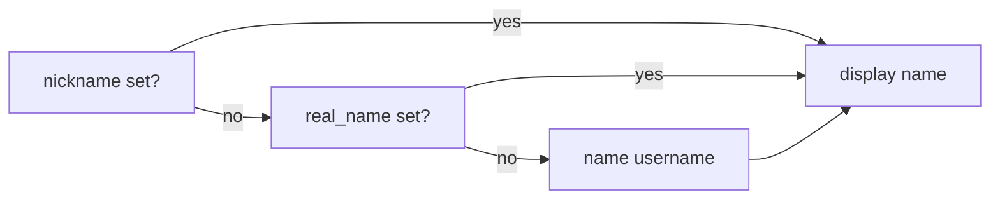
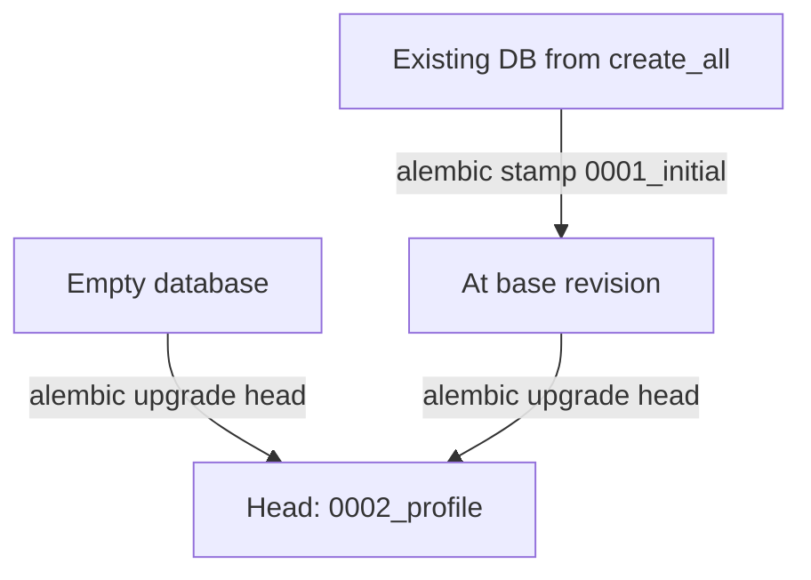

# User real_name and mobile fields

## Scope

| Field | DB column | Label (zh) | Constraints |
|-------|-----------|------------|-------------|
| Real name | `real_name` | 姓名 | Optional; Unicode allowed; **2–64** chars after trim; not unique |
| Mobile | `mobile` | 手机号 | Optional; user may type spaces/dashes (e.g. `+86 138-0013-8000`); **always stored normalized** in DB; **7–20** digits after normalize; **unique** on stored value (multiple `NULL` allowed) |
| Nickname | `nickname` (existing) | 昵称 | Keep **3–16** length; drop ASCII-only regex; allow Chinese/emoji; keep **unique** |

Display priority everywhere a **friendly name** is shown: **nickname > real_name > `name`** (login username; user called this `user_name`).



---

## 1. Alembic migrations (plain Alembic — no Flask-Migrate)

Use **[Alembic](https://alembic.sqlalchemy.org/)** directly (per [backend-rules](.cursor/rules/backend-rules.mdc)). **Do not** add `flask-migrate` or `Migrate(app, db)`.

**Revision ID length (required):** `alembic_version.version_num` is **`VARCHAR(32)`**. Every `revision` / `down_revision` must be **≤ 32 characters**. Filename slugs may be longer; the `revision = '...'` variable may not.

| Revision ID | File (example) | Purpose |
|-------------|----------------|---------|
| `0001_initial` (12 chars) | `alembic/versions/0001_initial.py` | Full schema **as today** (no `real_name` / `mobile`) |
| `0002_profile` (12 chars) | `alembic/versions/0002_profile.py` | Add `real_name`, `mobile` + unique on `mobile`; `down_revision = '0001_initial'` |

If autogenerate emits a 12-char hex id, **replace** with the short fixed ids above so docs/stamp commands stay stable.



### Layout (Alembic default — from `alembic init`)

Use the **stock** tree Alembic generates; do not rename `script_location` to `migrations` or other custom paths.

```
alembic.ini                 # script_location = alembic
alembic/
  env.py                    # Flask app context + target_metadata = db.metadata
  script.py.mako            # template for new revisions (leave default)
  README                    # optional upstream stub
  versions/
    0001_initial.py
    0002_profile.py
```

- [`alembic.ini`](alembic.ini): keep default `script_location = alembic`, `prepend_sys_path = .` (or project root) so `env.py` can `from app import app` and `from models import db`.
- [`alembic/env.py`](alembic/env.py): load `SQLALCHEMY_DATABASE_URI` from the Flask app inside `app.app_context()`; do not relocate files outside `alembic/`.
- Revisions live under **`alembic/versions/`** with default `file_template = %%(rev)s_%%(slug)s` (filenames align with short `revision` ids after edit).

### SQLite DB path resolution (Flask-SQLAlchemy parity)

Config uses relative SQLite URIs (e.g. [`config.json`](config.json) `sqlite:///auth.db`). **Flask-SQLAlchemy 3.x** resolves those relative to **`app.instance_path`** (typically `<project>/instance/auth.db`), **not** the shell cwd. Plain Alembic/SQLAlchemy would otherwise open `<cwd>/auth.db`, causing migrations against the **wrong file** or an empty new DB.

Add **[`utils/database_url.py`](utils/database_url.py)** with `resolve_database_uri(uri: str, app: Flask) -> str`:

| URI pattern | Resolved URL for Alembic engine |
|-------------|----------------------------------|
| `sqlite:///:memory:` / `sqlite://` | unchanged |
| `sqlite:////absolute/path.db` (4+ slashes on Linux) | unchanged (already absolute) |
| `sqlite:///relative.db` (3 slashes, relative) | `sqlite:///` + absolute path = `os.path.join(app.instance_path, relative.db)` |
| `postgresql://…` / other | unchanged |

Use in **`alembic/env.py`** for both online and offline modes:

```python
with app.app_context():
    uri = resolve_database_uri(app.config['SQLALCHEMY_DATABASE_URI'], app)
```

**Do not** pass the raw config string to Alembic when it is a relative SQLite path.

**Legacy / brownfield note:** DBs created before Flask-SQLAlchemy 3 (or via `db.create_all()` from repo root) may still live at **project root** (`./auth.db`) while the app now uses **`instance/auth.db`**. During implementation:

- Log resolved absolute path when `env.py` runs (one line at INFO) to aid debugging.
- README: for SQLite dev, prefer one location — if an old root-level file exists, move it into `instance/` (or point config at a 4-slash absolute URI) **before** `alembic upgrade head`.
- Optional test: given `sqlite:///test.db` and a temp Flask app, assert resolved path contains `instance` segment.

**Docker/production:** default compose URI is PostgreSQL — resolution is a no-op; SQLite rules apply to local/trial configs only.

### Setup (implementation order)

1. Add **`alembic`** to [`requirements.txt`](requirements.txt) (not `flask-migrate`).
2. Run **`alembic init alembic`** from repo root; wire [`alembic/env.py`](alembic/env.py) to [`app.py`](app.py) / [`models.py`](models.py) and **`resolve_database_uri`** for SQLite.
3. **Before** model changes: `alembic revision --autogenerate -m "initial"` → edit to `revision = '0001_initial'`, `down_revision = None`; review full DDL.
4. Add `real_name` / `mobile` to [`models.py`](models.py) + `to_dict()`.
5. `alembic revision --autogenerate -m "profile"` → edit to `revision = '0002_profile'`, `down_revision = '0001_initial'`; upgrade body:

```python
op.add_column('user', sa.Column('real_name', sa.String(64), nullable=True))
op.add_column('user', sa.Column('mobile', sa.String(20), nullable=True))
op.create_unique_constraint('uq_user_mobile', 'user', ['mobile'])
```

6. **[`app.py`](app.py) CLI:** remove or repoint `create-db` (`db.create_all`) — e.g. `upgrade-db` click command that runs `alembic upgrade head` via subprocess, **or** document only `alembic` CLI. Keep **`flask init-db`** for seed data.

### Docs / ops ([`README.md`](README.md))

Replace `flask create-db` with:

```bash
alembic upgrade head
flask init-db
```

**Existing DB** (schema matches base, no new columns):

```bash
alembic stamp 0001_initial
alembic upgrade head
```

Docker: `docker compose exec backend alembic upgrade head` then `flask init-db`. Run from repo root (where `alembic.ini` lives); ensure `PYTHONPATH` includes project root for `alembic/env.py` imports.

### Model changes (after base revision is committed)

```python
real_name = db.Column(db.String(64))
mobile = db.Column(db.String(20), unique=True)
```

Include both in [`User.to_dict()`](models.py) on all API user payloads.

No hand-written `ALTER TABLE` in README — Alembic is the single source of truth.

---

## 2. Shared validation (backend)

Add **[`utils/profile_validation.py`](utils/profile_validation.py)** (mirror pattern of [`utils/email_validation.py`](utils/email_validation.py)):

| Helper | Rules |
|--------|--------|
| `normalize_optional_text(value) -> str \| None` | `None` / blank → `None` |
| `validate_nickname(value) -> str \| None` | After trim: empty → `None`; else len 3–16; reject control chars / lone whitespace-only |
| `validate_real_name(value) -> str \| None` | After trim: empty → `None`; else len **2–64**; same char safety as nickname |
| `normalize_mobile(value) -> str \| None` | Canonical form written to DB / used for uniqueness (see below) |
| `validate_mobile(value) -> str \| None` | Blank → `None`; else return `normalize_mobile(value)` or raise/return error if invalid |

**Mobile input vs storage**

- **Accepted in API/forms:** digits, optional leading `+`, and “reasonable” separators — ASCII spaces, `-`, and `(` `)` (strip all of these before validation).
- **Rejected:** letters, other punctuation, multiple `+`, or `+` not at start.
- **Normalization algorithm** (shared backend + frontend):
  1. Trim outer whitespace.
  2. Remove spaces, `-`, `(`, `)` from the string.
  3. If empty → `None`.
  4. Must match `^\+?[0-9]{7,20}$` on the result.
  5. **Persist only this canonical string** (e.g. `138-0013-8000` → `13800138000`, `+86 138 0013 8000` → `+8613800138000`).
- **Uniqueness / duplicate check:** always on normalized value, so `138 0013 8000` and `138-0013-8000` collide.
- **API GET:** return normalized `mobile` from DB (UI can show as stored; user may re-enter with formatting on edit).
- **`display_name(user) -> str`:** `nickname or real_name or name` (strip each).

**[`services/user.py`](services/user.py)** changes:

- Remove `nickname_pattern` regex; use validators in `update_profile`.
- Extend `profile_fields` to `{'nickname', 'avatar', 'real_name', 'mobile'}`.
- `nickname`: duplicate check on non-null values (unchanged).
- `mobile`: `validate_mobile` returns canonical string; assign **only** normalized value to `user.mobile`; duplicate check on that value (exclude current user), raise `UserServiceError('duplicate mobile')`.
- `real_name`: no uniqueness check.
- Extend [`search_by_name`](services/user.py) filter to also match `real_name` (case-insensitive contains), and update admin search placeholder i18n.
- **`UserService.invite`**: add optional `real_name`, `mobile` kwargs; validate with same helpers (blank → omit/`None`); set on new `User` before commit; `duplicate mobile` if normalized mobile already taken.

Add focused tests: **`tests/test_profile_validation.py`** (nickname Unicode OK, real_name length, mobile normalize, duplicate mobile in `update_profile` **and** `invite`). Frontend tests for `normalizeMobile()` parity.

---

## 3. API surface

**Profile update** (unchanged routes):

- [`PUT /api/account/me`](api_account.py) → `UserService.update_profile(user, **params)`
- [`PUT /api/admin/users/<uid>`](api_admin.py) → same

Empty string for `real_name` / `mobile` clears to `NULL` (same as nickname).

**Admin invite** — extend existing [`POST /api/admin/users`](api_admin.py):

- Accept optional `real_name`, `mobile` in JSON (omit or `""` → not set).
- Pass through to `UserService.invite(...)`; return them on created user in `to_dict()` response.
- Free registration [`POST /api/account/register`](api_account.py) stays **name + email only** (no change).

**Mail sender name** — [`utils/mail.py`](utils/mail.py) line 55: use `display_name(sender)` instead of `sender.nickname or sender.name`.

**Email templates** (`Hi {{user.name}}`) — optional improvement: pass `display_name` into template context; lower priority than in-app UI (can keep `user.name` for legal/account identity in email body, or switch greeting to display name — recommend **greeting uses display name** via Jinja `user.display_name` property or template var set in `send_email`).

---

## 4. Frontend models and helpers

- **[`frontend/src/utils/userDisplayName.ts`](frontend/src/utils/userDisplayName.ts)** — `getUserDisplayName({ nickname?, real_name?, name })` matching backend priority; unit test in `userDisplayName.test.ts`.
- **[`frontend/src/utils/profileValidation.ts`](frontend/src/utils/profileValidation.ts)** — export `normalizeMobile()` + validators mirroring backend; forms validate **after** normalize (length 7–20 digits); hint text: separators allowed, stored without spaces/dashes.
- Update **[`frontend/src/models/user.ts`](frontend/src/models/user.ts)** and **[`frontend/src/models/admin.ts`](frontend/src/models/admin.ts)** zod schemas with `real_name` and `mobile` (nullable optional).
- Update model tests ([`user.test.ts`](frontend/src/models/user.test.ts), [`admin.test.ts`](frontend/src/models/admin.test.ts)).

**API helpers** — extend [`frontend/src/api/account.ts`](frontend/src/api/account.ts) and [`frontend/src/api/admin.ts`](frontend/src/api/admin.ts):

- Prefer a single `putAccountProfile(partial)` / `putAdminUserProfile(uid, partial)` accepting `{ nickname?, real_name?, mobile? }` (keep thin wrappers or replace nickname-only functions to avoid duplication).
- Extend [`AdminInviteBody`](frontend/src/api/admin.ts) with optional `real_name?`, `mobile?` for [`postAdminInviteUser`](frontend/src/api/admin.ts).

---

## 5. UI changes

### Admin invite modal ([`AdminUserInviteModal.tsx`](frontend/src/pages/admin/AdminUserInviteModal.tsx))

- Add optional **姓名** (`real_name`) and **手机号** (`mobile`) `TextInput`s below email (or after required fields).
- Validators: only when non-empty — reuse `profileValidation.ts` (`validateRealName`, `validateMobile`); no error if left blank.
- Submit: include trimmed values in `postAdminInviteUser` body only when provided; map `duplicate mobile` to `mobileDuplicate` like profile save.
- Labels/hints reuse invite-modal-friendly i18n (can share `realName`, `mobile`, `mobileHint` keys).

### Profile ([`ProfilePage.tsx`](frontend/src/pages/ProfilePage.tsx))

- Add sections/inputs for **姓名** (`real_name`) and **手机号** (`mobile`) with save actions (same pattern as nickname section).
- Relax `nicknameValidator` to length-only (drop `/^[ \w-]{3,16}$/`).
- Show login username (`name`) read-only as today; do not replace with display name in the “username” field.

### Admin user edit ([`AdminUserEditPage.tsx`](frontend/src/pages/admin/AdminUserEditPage.tsx))

- Same three profile fields editable by admin; shared validators from `profileValidation.ts`.

### Admin users list ([`AdminUsersPage.tsx`](frontend/src/pages/admin/AdminUsersPage.tsx))

- Add table columns **姓名** and **手机号** (raw values).
- Extend client-side filter to include `real_name` and `mobile`.
- Optionally show `getUserDisplayName(u)` in a “display” context only if you add a column — **not required** if dedicated columns exist.

### Display-name consumers (use `getUserDisplayName`)

| Location | Current |
|----------|---------|
| [`HomePage.tsx`](frontend/src/pages/HomePage.tsx) | `nickname \|\| name` |
| [`ShellHeaderAccountMenu.tsx`](frontend/src/components/layout/ShellHeaderAccountMenu.tsx) | `user.name` + avatar initial from `name` |
| [`AdminGroupEditPage.tsx`](frontend/src/pages/admin/AdminGroupEditPage.tsx) | `u.name` + optional `(nickname)` |
| [`AdminOAuthClientEditPage.tsx`](frontend/src/pages/admin/AdminOAuthClientEditPage.tsx) | `a.user.name` in authorizations table |

For group member lines, prefer **one** friendly label via `getUserDisplayName`, with `name` in muted secondary text if needed for admin clarity (e.g. `张三 · alice`).

### i18n ([`frontend/src/i18n/translations.ts`](frontend/src/i18n/translations.ts))

Add EN + zh keys: `realName`, `realNameSection`, hints/min/max errors, `mobile`, `mobileSection`, **`mobileHint`** (e.g. “Digits with optional +; spaces and dashes OK — saved without separators”), `mobileInvalid`, **`mobileDuplicate`**, updated nickname hints, `saveRealName`, `saveMobile`, admin search placeholder mentioning real name.

Map API `msg: duplicate mobile` to the duplicate error in profile save, admin user edit, and **invite modal** mutations.

---

## 6. Out of scope / unchanged

- **Login username** (`name`): registration/invite pattern `^[\w]{3,16}$` unchanged.
- **OAuth nested user** in admin authorizations: minimal `{ id, name, email }` — only change **display string** in table, not OAuth protocol.
- **2FA provisioning URI** ([`utils/two_factor.py`](utils/two_factor.py)): keep account `name` (stable id), not display name.
- **Admin confirm/delete dialogs** referencing `user.name`: keep account id for clarity.

---

## 7. Verification

- Migrations: `alembic upgrade head` hits `instance/*.db` for relative SQLite config; `tests/test_database_url.py` (or in profile tests file) covers instance-path resolution; revision IDs ≤ 32 chars.
- Backend: `pytest tests/test_profile_validation.py`
- Frontend: `npm test` for validation + display helper
- Manual: profile mobile normalize + duplicate; invite user with optional real_name/mobile filled; invite with fields empty still works; header/home display-name fallback unchanged
